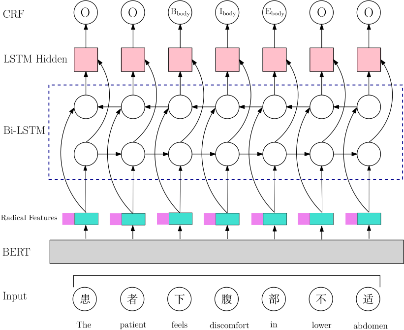

# Chinese clinical named entity recognition (CNER) using pre-trained BERT model


## Introduction
We pre-trained BERT model to improve the performance of Chinese CNER. Different layers such as Long Short-Term Memory (LSTM) and Conditional Random Field (CRF) were used to extract the text features and decode the predicted tags respectively. And we also proposed a new strategy to incorporate dictionary features into the model. Radical features of Chinese characters were also used to improve the model performance.


## Model structure




## Usage

### Pre-trained models
For replication, we uploaded two models in Baidu Netdisk.

Link: https://pan.baidu.com/s/1obzG6OSbu77duhusWg2xmQ
Code: k53q


### Examples
To replicate the result of CCKS-2018 dataset
```p
python main.py \
--data_dir=data/ccks_2018 \
--bert_model=model/  \
--output_dir=./output  \
--terminology_dicts_path="{'medicine':'data/ccks_2018/drug_dict.txt','surgery':'data/ccks_2018/surgery_dict.txt'}" \
--radical_dict_path data/radical_dict.txt \
--constant=0 \
--add_radical_or_not=True \
--radical_one_hot=False \
--radical_emb_dim=20 \
--max_seq_length=480 \
--do_train=True \
--do_eval=True \
--train_batch_size=6 \
--eval_batch_size=4 \
--hidden_dim=64 \
--learning_rate=5e-5 \
--num_train_epochs=5 \
--gpu_id=3 \
```


## Results

### CCKS-2018 dataset
| Method                     |   P   |   R   |   F1  |
| :--------------------------|:-----:|:-----:|:-----:|
| FT-BERT+BiLSTM+CRF         | 88.57 | 89.02 | 88.80 |
| +dictionary                | 88.58 | 89.17 | 88.87 |
| +radical(one-hot encoding) | 88.51 | 89.39 | 88.95 |
| +radical(random embedding) | 89.24 | 89.11 | 89.17 |
| +dictionary +radical       | 89.42 | 89.22 | **89.32** |
| ensemble                   | 89.59 | 89.54 | **89.56** |


| Team Name             | Method                                    | F1     |
|:----------------------|:------------------------------------------|:-------|
| Yang and Huang (2018) | CRF(feature-rich + rule)                  | 89.26  |
| heiheihahei           | LSTM-CRF(ensemble)                        | 88.92  |
| Luo et al.(2018)      | LSTM-CRF(ensemble)                        | 88.63  |
| dous12                | -                                         | 88.37  |
| chengachengcheng      | -                                         | 88.30  |
| NUBT-IBDL             | -                                         | 87.62  |
| Our                   | FT-BERT+BiLSTM  +CRF+Dictionary(ensemble) |  **89.56** |


### CCKS-2017 dataset 
| Method                     |   P   |   R   |   F1  |
|:---------------------------|:-----:|:-----:|:-----:|
| FT-BERT+BiLSTM+CRF         | 91.64 | 90.98 | 91.31 |
| +dictionary                | 91.49 | 90.97 | 91.23 |
| +radical(one-hot encoding) | 91.83 | 90.80 | 91.35 |
| +radical(random embedding) | 92.07 | 90.77 | **91.42** |
| +dictionary+radical        | 91.76 | 90.88 | 91.32 |
| ensemble                   | 92.06 | 91.15 | **91.60** |


| Team Name            | Method                                    | F1     |
|:---------------------|:------------------------------------------|:-------|
| Qiu et al. (2018b)   | RD-CNN-CRF                                | 91.32  |
| Wang et al. (2019)   | BiLSTM-CRF+Dictionary                     | 91.24  |
| Hu et al. (2017)     | BiLSTM-FEA(ensemble)                      | 91.03  |
| Zhang et al. (2018)  | BiLSTM-CRF(mt+att+ms)                     | 90.52  |
| Xia and Wang (2017)  | BiLSTM-CRF(ensemble)                      | 89.88  |
| Ouyang et al. (2017) | BiRNN-CRF                                 | 88.85  |
| Li et al. (2017)     | BiLSTM-CRF(specialized  +lexicons)        | 87.95  |
| Our                  | FT-BERT+BiLSTM  +CRF+Dictionary(ensemble) |  91.60 |

